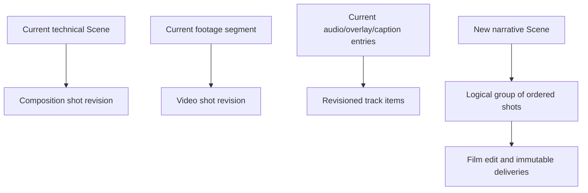
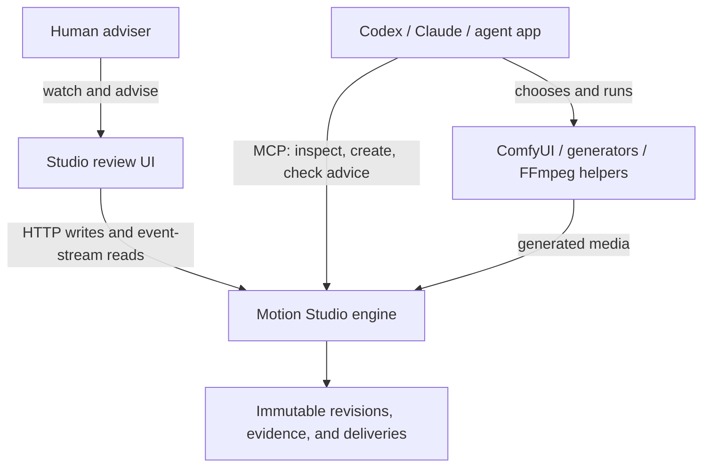
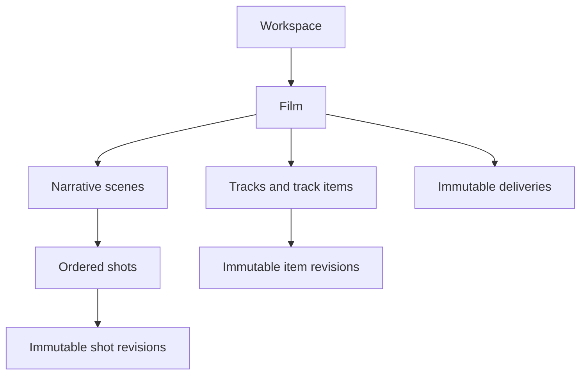
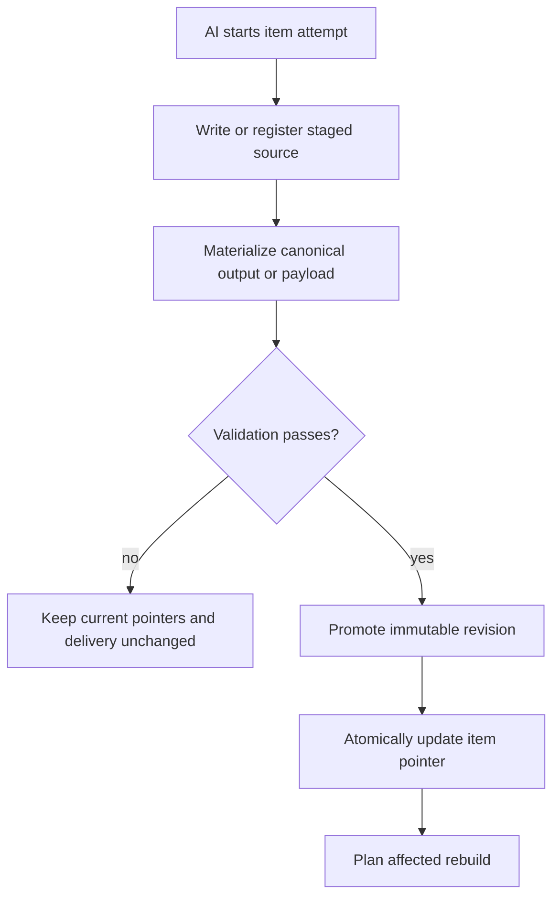
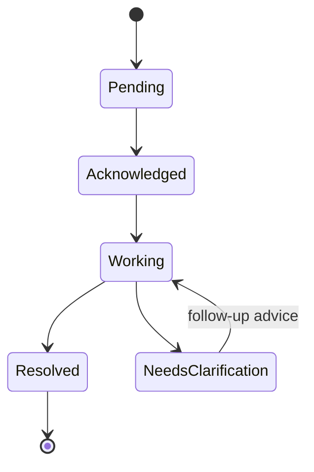
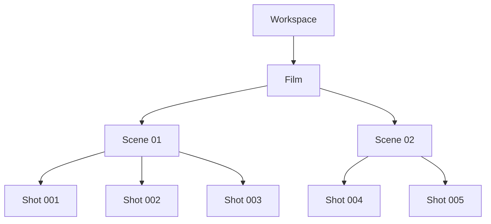

# Motion Studio V2 Final Plan: AI-First Direction, Atomic Shots, Advice, and Evidence

**Repository reviewed:** `bettertogethersoftware/motion-studio`  
**Reviewed commit:** `8dc3ab05c457d1ba6eaa5629d3f49a7eb6c9b17e` (`master`, checked 2026-08-01)  
**Plan revision:** 3 (2026-08-01)  
**Plan status:** Final proposed architecture and executable todo plan  
**Compatibility decision:** The redesigned runtime does not need to open old film documents, preserve old API contracts, or retain old terminology. It must leave old files untouched rather than deleting them.

---

## Implementation outcome (v0.23, 2026-08-01)

The product goals of this plan shipped; the ground-up "V2 runtime in a new
data root" did not, deliberately. The plan's own central insight — *"the
current technical scene already behaves like the intended shot"* — was taken
to its conclusion: the proven engine (staged atomic promotion, render
sidecars, lossless assembly, review gates, path sandbox, 754 green tests)
was kept, and the missing product layer was built natively on top of it.
See [docs/CHANGELOG.md](../CHANGELOG.md) "The production loop" and
[docs/architecture.md](../architecture.md) §14 for the shipped design.

**Delivered** — the definition of done in §17 holds end to end:

- AI-director / human-adviser contract, no approval gate anywhere
  (`core/advice.js`; MCP `check/acknowledge/begin/resolve/list` advice tools
  with TTL leases, restart recovery, idempotent retries, follow-up threads,
  and per-outcome resolutions the human reads).
- Immutable scene revisions with source snapshots, provenance, advice links,
  automatic archiving on every promoted canonical render, AI-only
  `use_scene_revision` repointing, and pinned retention
  (`core/revisions.js`).
- Immutable deliveries with frozen frame→revision manifests, current
  pointer, and snapshot-consistent click resolution (`core/deliveries.js`).
- Durable before/after evidence captured after the request commits, with
  failures recorded rather than fatal; "what I saw → what I said → what the
  AI changed" is navigable in the Studio.
- Review-first Studio surface (`review.html`): pinned-delivery player,
  sequence bands / scene blocks / track lanes / advice markers,
  click-to-resolve, one advice box, scene drill-in with version history,
  **Ask AI to use this version** (advice, never a direct pointer change),
  film-updated notification, deep links, no-delivery placeholders, human
  status vocabulary.
- Production SSE stream with monotonic ids + `Last-Event-ID` replay, fed by
  a cross-process workspace watcher; agent heartbeats + status projection
  (`core/events.js`, `core/activity.js`; `report_agent_activity`,
  `get_production_status`, `get_capabilities`).
- Agent instruction files updated with the startup/checkpoint protocol.

**Deliberate deviations from the plan:**

- **No parallel V2 data root or storage rewrite.** New state (revisions,
  deliveries, advice, activity) lives in new subfolders beside existing
  documents; old data is untouched and old surfaces keep working. The
  minimal-rebuild guarantees the plan wanted already existed in the engine
  (only changed scenes re-render; builds reuse rendered outputs).
- **Vocabulary:** the atomic render unit stays the **scene** (no engine-wide
  scene→shot rename); the narrative grouping is the **sequence** — a label
  on play-order segments plus `film.sequences` intent metadata. Same
  ambiguity killed, none of the churn.
- **Track items** (audio/captions/overlays) keep their stable ids and are
  fully advisable targets and frozen into delivery manifests; per-item
  immutable revision stores were not built — the asset-versioning convention
  plus film-document history covers today's need, and the advice/evidence
  model already binds to exact item payloads via the manifest.
- **Whole-array film patches remain** on the existing editor surface rather
  than item-addressed edit ops with ETags; single-writer-per-workspace plus
  atomic writes is the shipped concurrency story, and the review surface is
  read-only so the human cannot race the director.

Verified by 819 tests across 40 files (0 failures), including end-to-end
MCP production-loop and Studio review suites.

---

Revision 3 closes five design gaps in the prior draft: independent revision history for sound/caption/overlay items; snapshot-consistent film review; previous-version requests that remain advice rather than direct commands; an explicit Studio HTTP/event channel plus AI MCP polling; and idempotent, conflict-safe minimal rebuild execution.

## 1. Product definition

Motion Studio is a local, AI-first film-production environment.

The normal workflow is:

1. The human prompts an AI director in Codex, Claude, or another agent application.
2. The AI reads `AGENTS.md` or `CLAUDE.md`, discovers Motion Studio MCP, ComfyUI/generation helpers, FFmpeg, transcription, TTS, music, SFX, and other available capabilities.
3. The AI plans and produces the film unattended.
4. `npm run studio` lets the human observe the evolving film without becoming the production operator.
5. The human may return minutes or hours later, navigate from the film or a narrative scene to the exact shot, VFX/overlay, TTS, SFX, music, caption, or time range, and leave plain-language advice.
6. The active AI acknowledges that advice at its next checkpoint, decides the appropriate response, creates or selects an immutable item revision, materializes only affected items, and rebuilds the film automatically.

### Non-negotiable product decisions

- **AI is the director and operator.** It plans, chooses tools/models, creates media, validates outputs, manages revisions, and assembles deliverables.
- **Human is an asynchronous adviser.** The default Studio interface is for watching, navigating, advising, and reviewing past evidence—not managing tasks or directly editing production state.
- **There is no approval gate.** Production continues with zero human interaction. The AI never waits for approval.
- **Advice is durable evidence.** The human can return later and see what they saw, what they said, whether the AI received it, and what changed.
- **Shot is the atomic visual work unit.** One bad shot must not recapture unrelated shots.
- **Track item is the atomic non-picture work unit.** One bad TTS line, SFX cue, music segment, caption, or overlay must not regenerate unrelated items or recapture picture shots.
- **Narrative scene is an organizational unit.** It groups shots but is never a render job.
- **Revisions are immutable.** A new attempt never destroys the prior result. The current revision is a pointer.
- **A previous version is requested as advice, not forced as an edit.** The human previews an older version and selects **Ask AI to use this version**. The AI normally selects it, may derive a better revision from it, or records why it did not; Studio never changes the current pointer directly.
- **The primary human UI hides production machinery.** Claims, leases, source fingerprints, dependency graphs, providers, seeds, render signatures, and internal job states remain behind diagnostics.
- **Backward compatibility is out of scope.** The clean model may replace current storage, routes, MCP names, and Studio layout.
- **Every review is snapshot-consistent.** Advice always records the exact delivery/revision and time the human was viewing, even if production advances while the review screen is open.

### Human/AI responsibility contract

| Human action in Studio | Immediate result | What it never does |
|---|---|---|
| Watch, scrub, or select | Resolves the exact visible scene, shot, track item, revision, and time | Does not claim work or change production state |
| **Send advice** | Stores an immutable request and observation receipt | Does not pause the AI or create an approval gate |
| **Ask AI to use this version** | Stores high-priority advice naming the exact old revision | Does not restore the revision directly |
| Close Studio | Leaves all production and advice state durable | Does not cancel or suspend the AI |
| Return later | Reopens current output, unresolved advice, history, and before/after evidence | Does not require the prior browser session |

## 2. Current repository findings

The redesign should reuse proven engine primitives while replacing the ambiguous product model around them.

| Current code | What is already valuable | What must change |
|---|---|---|
| `engine/src/core/films.js`: `film.scenes[]` | Ordered union of rendered compositions and footage | Replace the misleading union with explicit film edit, scene, shot, and revision documents |
| `engine/src/core/store.js`: technical scene folders | Independent, self-contained HTML/CSS/JS render units | Rename the concept to composition shot and store it as a shot source |
| `engine/src/core/film.js`: `filmLayout`, `validateScenes`, `assembleFilm` | Frame offsets, signature checks, lossless concatenation, master audio | Generalize inputs from scene/footage to resolved shot and track-item revisions |
| `engine/src/core/renderer.js` and `engine/src/core/delivery.js` | Deterministic Chromium capture, FFmpeg encode, staging, validation, safe promotion | Render into immutable shot revisions rather than overwriting one scene output |
| `engine/src/studio/public/film.js` | Real film playback, timeline blocks, audio/caption/overlay lanes, per-composition rendering | Replace the large editor-first surface with review-first Film, Scene, Shot, and Track Item navigation |
| `engine/src/core/jobs.js` | Render/task lanes, progress, logs, cancellation | Keep for live work; do not use it as durable advice or revision history because jobs are memory-only |
| `engine/src/mcp/server.js` | Broad film, media, render, audio, transcription, and review capability | Add explicit scene/shot/track-item/revision/advice/rebuild contracts and remove scene-as-shot ambiguity |
| `docs/SKILL.md` and MCP descriptions | Already tell agents to create one short technical scene per shot/beat and rerender only the changed unit | Make this an enforced data model and mandatory advice-check protocol |
| Render sidecars | Detect config mismatch and replaced output | Add complete source/dependency fingerprints so automatic stale detection is trustworthy |
| Workspace-per-agent model | Isolates writers | Redefine workspace as a production space; identify agents separately and lease work at film/shot scope |
| `engine/src/studio/server.js` and `engine/src/studio/public/film.js` | Studio HTTP API, film editor, job polling, and scene-only hot-reload SSE | Replace whole-array editing with review APIs and add one production event stream for films, shots, track items, advice, revisions, jobs, and deliveries |

### Central implementation insight

The current technical scene already behaves like the intended shot:



The capture and assembly engine does not need to be discarded. Its inputs and ownership model need to be redesigned.

## 3. System boundary

Motion Studio does not become another AI chat application.



The agent application owns conversation, model selection, and creative direction. Motion Studio owns production truth, stable IDs, media lineage, review evidence, affected-rebuild planning, and deterministic delivery. Studio uses the engine's HTTP API; the AI uses MCP. Neither side scrapes or controls the other application's UI.

## 4. Clean domain model

### 4.1 Hierarchy



Definitions:

- **Workspace:** a production space visible to the human and one or more identified agents. It is not the identity of one AI.
- **Film:** the authoritative edit, film-wide tracks, delivery settings, and current delivery.
- **Scene:** a narrative/story grouping. It owns a name, intent, and notes; it does not render.
- **Shot:** the smallest independently replaceable visual timeline item. It has fixed timing and a current revision; its source kind may change between revisions.
- **Track:** an ordered lane such as dialogue, SFX, music, captions, or overlays.
- **Track item:** the smallest independently replaceable timed non-picture item. It has a stable ID, anchor, duration, and current revision.
- **Revision:** an immutable, validated realization of a shot or track item, including source/provenance, output or payload, preview, measurements, and review evidence. A failed attempt is a job/staging result, not a promoted revision.
- **Advice:** immutable human intent plus mutable processing state and before/after evidence.
- **Delivery:** an immutable built-film revision with a frozen manifest mapping every visible frame and track item to exact revisions; one delivery pointer is current.
- **Production head:** the latest film edit plus current shot/track-item pointers. It may be newer than the current delivery while the AI is still working or building.
- **Review context:** the exact delivery or individual item revision currently shown to the human. Advice binds to this context, not implicitly to the production head.

### 4.2 Picture-revision source model

For shot revisions, use a small mechanical source-kind set and record origin separately:

| `source.kind` | Examples |
|---|---|
| `composition` | HTML/CSS/JavaScript, Three.js, Babylon.js |
| `image` | Human/imported still, generated still, image sequence |
| `video` | Human footage, screen recording, AI-generated video, imported clip |

Use `source.origin` for `human`, `generated`, `imported`, or `system`. These fields belong to the revision, not the shot, because an AI director may replace a composition with generated video or human footage without changing the stable shot identity or losing its history.

This avoids separate renderer branches for `generated-video` versus `human-footage` while preserving the provenance the AI and evidence views need.

### 4.3 Track item model

Track items use one stable identity and immutable revisions instead of whole-array replacement:

| `trackItem.kind` | Revision payload | Typical rebuild |
|---|---|---|
| `tts` | Text, voice/provenance, conformed audio | Audio mix and delivery finishing |
| `sfx` | Cue instructions/provenance and conformed audio | Audio mix and delivery finishing |
| `music` | Score/source/provenance and conformed audio | Audio mix and delivery finishing |
| `caption` | Text, timing, and style data | Caption sidecar or delivery finishing |
| `overlay` | Image/video/composition source plus placement | Overlay materialization and delivery finishing |

A VFX change embedded inside a picture composition creates a new shot revision. A timeline overlay or alpha VFX element is an `overlay` track item and receives its own revision. The human never has to decide which technical category applies; the selected UI object and the AI's interpretation determine it.

Canonical picture-shot outputs are silent. If imported/generated video contains intentional diegetic audio that must remain independently revisable, ingestion extracts or links it as a track item rather than hiding it inside the picture revision.

### 4.4 One authoritative edit

All scene and shot ordering lives in one film edit document so a cross-scene move is one atomic write:

```json
{
  "schema": "motion-studio.film/v2",
  "id": "product-film",
  "name": "Product Film",
  "documentRevision": 18,
  "edit": [
    {
      "sceneId": "intro",
      "shotIds": ["shot-001", "shot-002", "shot-003"]
    },
    {
      "sceneId": "demo",
      "shotIds": ["shot-004", "shot-005"]
    }
  ],
  "tracks": [
    { "id": "dialogue", "kind": "audio", "itemIds": ["tts-001"] },
    { "id": "effects", "kind": "audio", "itemIds": ["sfx-001"] },
    { "id": "graphics", "kind": "visual", "itemIds": ["overlay-001"] },
    { "id": "captions", "kind": "caption", "itemIds": ["caption-001"] }
  ],
  "deliverySettings": {
    "master": { "width": 1920, "height": 1080, "fps": 30 }
  }
}
```

Scene, shot, and track-item documents contain identity and content, never a competing order. The film edit owns structural ordering; item documents own current-revision pointers. Timeline mutations are item-addressed operations, never client-supplied replacement of a complete array.

### 4.5 Scene document

```json
{
  "schema": "motion-studio.scene/v1",
  "id": "demo",
  "name": "Demonstration",
  "intent": "Show the product solving the core workflow",
  "documentRevision": 3
}
```

### 4.6 Shot document

```json
{
  "schema": "motion-studio.shot/v1",
  "id": "shot-004",
  "name": "Product reveal",
  "intent": "Reveal the finished product without changing its silhouette",
  "durationInFrames": 120,
  "currentRevisionId": "rev-006",
  "documentRevision": 11
}
```

Normal regeneration keeps `durationInFrames` fixed. Duration changes require an explicit ripple-edit operation because every later cue depends on it.

### 4.7 Track-item document

```json
{
  "schema": "motion-studio.track-item/v1",
  "id": "tts-001",
  "kind": "tts",
  "name": "Opening narration",
  "anchor": {
    "type": "shot",
    "shotId": "shot-004",
    "offsetFrames": 12
  },
  "durationInFrames": 86,
  "currentRevisionId": "rev-tts-003",
  "documentRevision": 7
}
```

An anchor is either film-relative or `{ shotId, offsetFrames }`. Shot-relative anchors survive reorder and scene moves. Human-facing shot numbers are computed from the current edit; references use immutable IDs that are never derived from a mutable name or sequence number.

## 5. Storage design

Shots live at film level, not physically inside scene folders. Moving a shot between scenes therefore changes only the film edit; its ID, path, history, and advice references remain stable.

```text
<dataDir>/workspaces/<workspace>/films/<film>/
├── film.json
├── scenes/
│   └── <scene>/
│       └── scene.json
├── shots/
│   └── <shot>/
│       ├── shot.json
│       ├── revisions/
│       │   └── <revision>/
│       │       ├── revision.json
│       │       ├── source/
│       │       ├── output.mp4
│       │       ├── preview.jpg
│       │       ├── render.json
│       │       └── review.json
│       └── staging/
├── track-items/
│   └── <track-item>/
│       ├── item.json
│       ├── revisions/
│       │   └── <revision>/
│       │       ├── revision.json
│       │       ├── source/
│       │       ├── output.*
│       │       ├── preview.*
│       │       └── review.json
│       └── staging/
├── advice/
│   └── <advice>/
│       ├── request.json
│       ├── state.json
│       ├── events/
│       │   └── <event>.json
│       ├── evidence/
│       │   ├── before.json
│       │   ├── before.jpg
│       │   ├── before-audio.wav
│       │   └── after.*
│       ├── resolution.json
│       └── links.json
├── assets/
├── deliveries/
│   └── <delivery>/
│       ├── film.mp4
│       ├── manifest.json
│       ├── review.json
│       ├── contact.png
│       └── captions.srt
└── out/
    └── current.json
```

### Storage rules

- Revision directories are immutable after promotion.
- Stable IDs are opaque and immutable. Renaming or reordering changes metadata/edit documents, never IDs or paths.
- Composition revisions retain the authored source snapshot needed for later rework or rollback.
- Image/video revisions retain the exact source/provenance manifest and conformed output used by the film.
- Shot and track-item staging are renamed into `revisions/<revision>` only after validation succeeds. A failed attempt remains a job/staging diagnostic and never masquerades as a usable revision.
- The owning item's `currentRevisionId` changes atomically only after the revision directory is durable.
- A delivery is immutable. Its `manifest.json` freezes the film edit, shot/track-item revision IDs, compiled frame ranges, delivery settings, and source fingerprints that produced the visible file.
- `out/current.json` is an atomically replaced pointer to a validated delivery; the visible film is never overwritten in place.
- Advice `request.json` is immutable. Each receipt/lease/resolution transition appends an immutable event file; `state.json` is a replaceable projection for fast reads, and `resolution.json` is the terminal explanation/evidence link.
- Evidence capture failure never loses human advice. The request is committed first, then evidence is captured or an explicit evidence warning is recorded.
- Advice and deliveries pin every revision they reference. Retention must never delete pinned evidence.
- Old storage is never deleted automatically. The v2 runtime starts in a new data root or rejects old schemas with a clear message. Importing old work is outside the primary runtime.

## 6. Revision lifecycle

### 6.1 Creating a revision



Failure leaves the current revision and current film untouched.

### 6.2 Revision contents

`revision.json` records when available:

- Revision ID, owning shot/track-item ID, creator agent, timestamps
- Source kind and origin
- Prompt/instructions
- Provider, model, workflow, seed, and generation settings
- Reference assets and their identities
- Composition source fingerprint or imported-media provenance
- Declared and measured frame count
- Encode/colour signature
- Review warnings and measurements
- Parent revision, advice IDs, and idempotency/request ID that caused the revision
- For track items: compiled anchor/window, source duration, conformance decisions, loudness/text/style measurements, and canonical payload identity

Missing provider-specific fields are allowed; fabricated provenance is not.

### 6.3 Automatic current revision

- The newest successfully validated revision normally becomes current automatically.
- No human approval is requested.
- Older revisions remain previewable.
- If a newer result is worse, the human selects an older revision and chooses **Ask AI to use this version**.
- That action creates high-priority advice with `suggestedAction: "prefer-revision"`, the exact preferred revision ID, the currently visible revision, and the visible delivery.
- Because the human remains an adviser, the next AI may select that revision, derive a new revision from it, or decline with a concise recorded reason. It must not silently ignore the request.
- `use_shot_revision` or `use_track_item_revision` is an AI-only production mutation. It changes only the relevant current pointer and triggers affected rebuild work; it never deletes newer history or regenerates media.

## 7. Human advice and evidence

### 7.1 Human-facing behavior

The human does not manage advice states. They see only:

- **Advice sent**
- **AI received it**
- **AI is working on it**
- **Film updated**
- **AI needs more information**
- **AI reviewed it** with a short explanation when no change was made

The primary advice interaction is one text box with the target filled automatically from the current selection.

### 7.2 Advice request

```json
{
  "schema": "motion-studio.advice-request/v1",
  "id": "advice-018",
  "filmId": "product-film",
  "target": {
    "type": "shot",
    "id": "shot-004",
    "observedSceneId": "demo",
    "anchor": {
      "filmFrame": 1152,
      "itemFrame": 42
    }
  },
  "observation": {
    "source": "delivery",
    "deliveryId": "delivery-021",
    "revisionId": "rev-006",
    "manifestHash": "sha256:..."
  },
  "suggestedAction": "rework",
  "message": "The product changes shape halfway through. Keep it identical to the reference image.",
  "createdAt": "2026-08-01T08:10:00Z"
}
```

Valid targets include:

- Film
- Narrative scene
- Shot
- Film/shot time or frame range
- Track item (`tts`, `sfx`, `music`, `caption`, or `overlay`)
- Film or item frame/time range

The human does not need to select a category. Clicking the video/timeline/track determines the structural target, and the AI interprets the words. `target.id` remains authoritative if a shot later moves scenes; `observedSceneId` records what the human saw at submission time.

### 7.3 Observation and rebase rules

- Film/Scene playback resolves selection against the pinned delivery manifest, never against a newer in-memory edit.
- Shot/track-item preview records the exact visible revision even when it is newer than the current film delivery.
- Advice remains valid when the target moves or is renamed because the stable target ID does not change.
- If the target was deleted, replaced, or materially changed since the observation, the AI must compare the observed and current revisions before acting.
- The AI may rebase compatible advice onto the current revision, combine multiple compatible advice items into one revision, or request clarification. It must link every consumed advice ID to the resulting revision/resolution.
- Conflicting or obsolete advice is never silently discarded. A terminal resolution records `applied`, `partially-applied`, `superseded`, or `not-applied` with a concise reason.
- The human cannot edit old wording. A follow-up creates a new linked advice request, preserving the original evidence.

### 7.4 Internal state



Rules:

- `check_human_advice` is read-only and returns all unresolved actionable advice, including acknowledged items abandoned by a previous agent.
- `acknowledge_human_advice` records receipt but does not hide the item from recovery.
- `begin_advice_work` acquires a renewable internal lease so two agents do not process the same advice concurrently.
- An expired lease makes the advice actionable again.
- `resolve_human_advice` records outcome, explanation, exact revision, rebuild, and delivery results. A resolved item does not imply that every suggestion was applied.
- Advice is never blanked or deleted after reading.
- Every transition appends an immutable advice event before updating the current state projection.

### 7.5 Evidence package

When advice is created, Studio stores:

- Original human wording
- Stable Film, Scene-at-observation, Shot/track-item, and frame/time references
- Exact visible item revision, delivery, and manifest identity
- The exact visible frame for picture/VFX advice, or a bounded audio excerpt/waveform and timing manifest for sound advice
- The visible caption/overlay payload where applicable
- A durable deep link that reopens the same item, revision, and time
- Immutable references needed to replay the before state; capture warnings if an optional thumbnail/audio excerpt failed

When resolved, Motion Studio stores:

- Acknowledging/resolving agent and timestamps
- Action taken
- New, selected, or derived revision IDs
- All advice IDs combined into the result and the parent revision used
- Render/materialization and film-build job IDs
- Resulting delivery ID
- Same-position after frame/audio/payload when applicable
- Outcome and the AI's concise explanation
- Any validation warning or clarification message

The human can later open **Past advice** at Film, Scene, Shot, or Track Item scope and see:

**What I saw → What I said → What the AI changed**

### 7.6 Unattended communication sequence

```mermaid
sequenceDiagram
    participant H as Human
    participant S as Studio
    participant M as Motion Studio
    participant A as AI director
    H->>S: Send advice on visible item
    S->>M: Persist request and observation
    M-->>S: Durable receipt
    Note over A: AI may be offline for hours
    A->>M: check_human_advice
    M-->>A: Unresolved advice and evidence refs
    A->>M: Acknowledge and lease
    A->>M: Promote item revision and rebuild
    A->>M: Resolve with outcome and evidence
    M-->>S: Production event; Studio refreshes
```

## 8. Agent protocol and MCP surface

### 8.1 Required startup protocol

`AGENTS.md`, `CLAUDE.md`, `docs/SKILL.md`, and `docs/SKILL-shell.md` must instruct every active director to:

1. Read repository instructions and discover capabilities.
2. Call `get_capabilities` and inspect the workspace/film.
3. Call `check_human_advice` before planning new work.
4. Acknowledge received items.
5. Review relevant unresolved advice before optional improvements; combine, apply, or explicitly resolve it according to the advisory contract.
6. Continue immediately when no advice exists.

### 8.2 Checkpoints during a run

The AI checks advice:

1. At task start
2. After publishing the narrative scene/shot/track plan
3. Before an expensive image/video generation request
4. After completing each shot or track-item revision
5. Before building the film
6. Before reporting completion

There is no blocking wait for advice and no approval polling loop.

Ordinary MCP cannot awaken a stopped Codex/Claude session. Advice remains durable until the human tells the agent application to continue, or until a future optional background director exists. A background director is not required in this plan.

`check_human_advice` is a non-blocking reconciliation call. It returns unresolved items oldest-first, supports `filmId`, cursor, and bounded `limit` filters, and does not mark anything read. The AI never loops waiting for a human response.

### 8.3 Capability and activity tools

- [ ] `get_capabilities` — Motion Studio features, configured vendors, media helpers, and supported shot/track-item kinds; no secrets.
- [ ] `report_agent_activity` — lightweight film/scene/shot/item activity such as planning, generating, rendering, revising, building, or idle.
- [ ] `get_production_status` — current edit, derived item readiness, simple progress, active jobs, unresolved advice count, current delivery, and whether newer revisions await a build.

Studio uses this data only to show simple progress such as **AI creating Shot 4 of 12**. The human does not manage the activity state.

### 8.4 Film, scene, shot, and track-item tools

- [ ] `create_film`, `get_film`, `update_film`, `remove_film`
- [ ] `create_scene`, `get_scene`, `update_scene`, `move_scene`, `remove_scene`
- [ ] `create_shot`, `get_shot`, `update_shot`, `move_shot`, `remove_shot`
- [ ] `render_shot` for composition/image rendering
- [ ] `register_shot_revision` for externally generated/imported/conformed media
- [ ] `list_shot_revisions`
- [ ] `use_shot_revision`
- [ ] `create_track_item`, `get_track_item`, `update_track_item`, `move_track_item`, `remove_track_item`
- [ ] `register_track_item_revision` for TTS, SFX, music, caption, and overlay payloads
- [ ] `list_track_item_revisions`
- [ ] `use_track_item_revision`

Do not keep aliases where `scene` still means atomic render unit. Generation-specific tools such as speech/music/SFX creation return or register a track-item revision instead of writing an anonymous file and replacing a film array.

### 8.5 Advice tools

- [ ] `check_human_advice`
- [ ] `acknowledge_human_advice`
- [ ] `begin_advice_work`
- [ ] `resolve_human_advice`
- [ ] `list_human_advice`

Every result carries stable film, scene, shot, track-item, revision, advice, job, and delivery IDs where applicable.

### 8.6 Rebuild tools

- [ ] `plan_affected_rebuild`
- [ ] `rebuild_affected`

`plan_affected_rebuild` is inspectable and pure. `rebuild_affected` executes that plan through the existing job system.

### 8.7 Cross-cutting mutation contract

Every MCP mutation includes:

- `agentId` from the authenticated/configured connection context
- Client-generated `requestId` for idempotent retry
- `expectedRevision`/ETag for any mutable document or pointer it changes
- Stable result IDs and structured error codes

Retrying the same `requestId` returns the original result rather than creating duplicate shots, revisions, advice events, or builds. A conflict never falls back to last-write-wins. Tool results expose creative provenance and validation facts but never secrets.

### 8.8 Studio HTTP and event channel

Studio does not call MCP. Add a human-facing HTTP surface that reuses the same domain services:

- [ ] Read current film/scene/shot/track-item views and immutable delivery manifests.
- [ ] Resolve a film frame to the exact visible scene, shot, item revisions, and item-relative frame.
- [ ] Submit advice with observation context and receive a durable receipt.
- [ ] List advice and revision history by film, scene, shot, or track-item scope.
- [ ] Serve pinned before/after evidence and deep links safely.
- [ ] Expose one reconnectable Server-Sent Events stream for document, item, advice, job, and delivery changes.

Events are notifications, not production truth. Each event carries a monotonic event ID, entity type/ID, and revision; reconnect uses `Last-Event-ID`, and Studio refetches canonical state. MCP polling remains the AI communication channel, so a disconnected browser never affects production.

## 9. Studio review-first interface

### 9.1 Default navigation



Required behavior:

- [ ] Sidebar/tree expands as `Workspace → Film → Scene → Shot`.
- [ ] Film view plays one pinned delivery and displays narrative-scene bands, shot boundaries, track lanes, and unresolved-advice markers.
- [ ] Clicking the film picture or timeline resolves the containing scene, shot, visible revision, overlapping track items, and exact time from that delivery's manifest.
- [ ] Scene view plays the pinned delivery's scene range continuously and shows its ordered shot strip; already-promoted work newer than that delivery is labelled clearly rather than silently substituted.
- [ ] Shot view opens on the exact revision the human clicked and exposes compact advice/revision history plus a clear **newer version available** indicator when applicable.
- [ ] Breadcrumb remains visible: `Product Film › Demonstration › Shot 12`.
- [ ] **Previous shot** and **Next shot** work without returning to the tree.
- [ ] Drilling down preserves film playhead and shot-relative position.
- [ ] **Back to film at 00:38.400** returns to the same moment.
- [ ] Tree, film timeline, scene strip, breadcrumb, preview, and advice target always identify the same shot.
- [ ] Stable shot ID is visible for reference but never needs to be typed or copied.
- [ ] Deep links encode workspace, film, scene, shot/track-item, revision/delivery, and time so the human can return to evidence later.
- [ ] When no delivery exists yet, Film/Scene views show simple planned/ready placeholders while each promoted shot remains individually previewable and advisable.

### 9.2 Snapshot-consistent viewing

- A player session pins its delivery/manifest ID until the human reloads or explicitly chooses the newly available film. It never swaps media beneath the current playhead.
- Film-frame-to-item resolution uses the pinned manifest, not the newest `film.json` or current revision pointers.
- The Shot view labels whether it is showing **Seen in Film**, **Latest work**, or **Older version**.
- Advice automatically captures whichever revision is actually visible. The human never chooses a revision ID from a form.
- A new delivery produces a small **Film updated** notification. Accepting that playback update is normal navigation, not approval of the AI's work.

### 9.3 Primary human actions

The default review UI exposes only:

- Watch/play/scrub
- Navigate Film → Scene → Shot
- **Advise AI**
- View unresolved and past advice
- Preview prior shot versions
- **Ask AI to use this version**

Remove direct production-edit/configuration controls from the human review surface. Global application settings and read-only diagnostics may remain, but film changes flow through human advice and AI action.

### 9.4 Advice creation

- Clicking a shot targets that shot.
- Clicking film playback targets the containing shot plus exact film/shot time.
- Clicking an audio, caption, or overlay item targets that item.
- Studio captures evidence automatically.
- The human sees one text area and **Send advice**.
- Unresolved advice appears as a small marker on the affected shot/track.
- Submitting the same concern again is allowed; evidence remains separate.
- Advice submission succeeds as soon as the request is durable; optional image/audio evidence capture may finish asynchronously.

### 9.5 Revision history

- The revision used by the visible film and the latest production revision are both identified without calling either one “approved.”
- Previous shot and track-item revisions appear newest-first with thumbnail/video/audio/text preview, date, and a short AI-produced summary.
- Provider/model/seed details remain in diagnostics, not the main card.
- Previewing an old revision does not change the film.
- **Ask AI to use this version** creates advice and returns immediately.
- Comparison supports picture side-by-side/scrub, audio A/B, and caption/overlay payload differences without exposing production controls.
- After the AI acts, advice history links the selected/derived revision, explanation, and resulting film delivery.

### 9.6 Progress presentation

Show only simple human-readable states:

- Planning film
- Creating Shot 4 of 12
- Revising Shot 7
- Revising opening narration
- Building film
- Film updated
- Waiting for next AI run

Do not expose claims, leases, cache keys, dependency nodes, render signatures, or raw queue administration in the normal interface.

Progress is derived primarily from durable edit/item state and enhanced by live agent/job activity. If the AI disconnects, stale heartbeat text expires and Studio shows **Waiting for next AI run** without losing completed work or advice.

## 10. Item materialization and smart rebuild

### 10.1 Canonical materialization

The picture assembler consumes one validated, silent canonical video output per current shot revision. Track items expose validated canonical audio, text/style payloads, or alpha-capable visual outputs.

| Source | Materialization |
|---|---|
| Composition | Chromium frame capture plus FFmpeg encode |
| Image | Deterministic image-duration/pan/zoom composition or FFmpeg path |
| Video | Validate/conform/trim to the film signature and exact frame count; no Chromium recapture |
| TTS/SFX/music item | Validate/conform audio format, duration window, channel layout, and loudness metadata |
| Caption item | Validate timed text/style payload; no picture capture |
| Overlay/VFX item | Validate/materialize image, alpha video, or composition output for the declared timing window |

External AI generation happens through tools chosen by the AI director. Motion Studio registers the resulting media as a staged revision, conforms it when needed, validates it, and promotes it.

### 10.2 Source fingerprint

Every promoted revision records a dependency manifest/fingerprint covering:

- Shot/track-item and render/materialization configuration
- Composition HTML/JS/CSS and local libraries
- Referenced item and film assets
- Generator request/provenance
- Imported media identities
- Film encode/colour signature
- Exact tool/engine version and canonicalization settings that can change output bytes

Use content hashes for small authored files and stable path/size/mtime identities for large media. Exclude staging, outputs, review artefacts, and other derived files.

### 10.3 Rebuild planner

`planAffectedRebuild` maps a changed entity to the smallest valid operations:

| Change | Work required |
|---|---|
| Composition/VFX in one shot | Render that shot revision; rebuild film |
| Generated-video replacement | Register/conform that shot revision; rebuild film; no Chromium for other shots |
| Human footage replacement | Conform/validate that shot revision; rebuild film |
| Image replacement | Render/materialize only dependent shot; rebuild film |
| SFX or TTS item | Regenerate/replace track item; rebuild audio/film; no picture-shot renders |
| Music-item revision | Rebuild master audio/film; no picture-shot renders |
| Caption-item revision | Rebuild sidecar and run finishing only when captions are burned |
| Overlay/VFX-item revision | Materialize only that overlay if needed; run finishing; no picture-shot renders |
| Shot reorder | Reassemble/finish film only |
| Narrative scene rename | Metadata/UI update only; no media work |
| Prior shot/track-item revision selected | Repoint revision; rebuild affected outputs; no regeneration |
| Deliverable crop/aspect | Reuse master; run deliverable finishing pass |

The planner returns ordered operations, dependency reasons, expected document revisions, inputs to reuse, and inputs to create. Execution revalidates those preconditions before each promotion so a plan cannot overwrite work that changed after planning.

The build graph has four independently inspectable stages:

1. Materialize changed shot/track-item revisions.
2. Reassemble the picture master from existing canonical shot outputs, using lossless concat when signatures permit.
3. Rebuild the audio master from current track-item revisions.
4. Run only the required delivery finishing passes for captions, overlays, reframing, or muxing.

Changing one item may still require a full-film finishing encode when the film burns captions, applies overlays, mixes master audio, or creates an aspect variant. The guarantees are deliberately narrower and testable:

> Unchanged shot sources are never recaptured or regenerated. Unchanged track-item sources are never regenerated. Existing immutable revision directories are never rewritten.

### 10.4 Timing invariant

- Normal rework keeps the shot frame count unchanged.
- Generated/imported media is measured, then trimmed, extended, retimed, or rejected to match the declared count.
- A duration change uses an explicit `ripple_shot_duration` operation.
- Normal TTS/SFX/music rework stays within the track item's declared window; changing its timing uses an explicit item timing operation.
- Shot-specific items prefer `{ shotId, offsetFrames }` anchors and compile to film frames during planning.
- Ripple planning reports every shifted shot/item/caption/overlay before execution and uses one atomic film-edit transaction.

## 11. Concurrency, identity, and reliability

### 11.1 Agent identity

- Workspace identifies the production space.
- Each MCP connection supplies a separate `agentId` and optional capability summary.
- One renewable, expiring director lease controls structural film edits at a time.
- Shot, track-item, and advice leases permit bounded parallel work without whole-film collision.
- Helper models used internally by the director do not become independent film writers unless explicitly connected as agents.
- Human advice submission never waits for an AI lease; it appends independently and is reconciled by the next checkpoint.

### 11.2 Optimistic concurrency

- Film, scene, shot, track-item, advice-state, and current-revision-pointer writes carry `documentRevision`/ETag.
- Mutations require `expectedRevision` and fail with a structured conflict rather than overwriting human/agent changes.
- Timeline operations are item-addressed (`move_shot`, `insert_shot`, `remove_shot`) and update the single film edit atomically.
- Advice leases expire and recover after crashes.
- Idempotency records survive process restart for at least the revision/advice retention window.

### 11.3 Durable versus live state

Durable:

- Film edit, scenes, shots, track items, revisions
- Advice requests/events/states/resolutions/evidence
- Deliveries, frozen manifests, and reviews
- Current pointers

Live/replaceable:

- Job progress, logs, ETA
- Agent heartbeat/activity
- Preview transport state
- SSE connections and event-delivery cursors held by a browser

Restarting Studio or MCP must not lose durable state. Losing live state must leave staged work recoverable or safely discardable without damaging current revisions/deliveries. On restart, the engine removes only proven-abandoned temporary staging, expires stale leases/heartbeats, recomputes derived readiness, and emits a fresh status snapshot.

### 11.4 Retention

- Never delete the current revision or current delivery.
- Never delete a revision/delivery referenced by advice evidence or a frozen delivery manifest.
- Retain a configurable number/size of unpinned revisions.
- Cleanup is explicit, logged, and never runs inside a promotion transaction.

## 12. Security and integrity

- Preserve the existing path sandbox; every new scene/shot/track-item/revision/advice/evidence path resolves beneath its film.
- Advice text is data, never a shell command.
- MCP continues to expose named operations, not arbitrary shell access.
- Credentials remain environment/configured-vendor concerns and never enter revision or advice evidence.
- HTML composition preview remains isolated from Studio origin/data.
- Evidence/deep-link endpoints resolve only stable IDs and allow-listed artefacts; they never accept arbitrary filesystem paths or remote URLs.
- File writes use staged atomic promotion on the same volume.
- Windows file-lock and rename behavior is tested explicitly; a failed pointer swap leaves the prior pointer valid.
- Old data is left untouched when the new runtime refuses it.
- Human evidence wording is immutable; resolution may append but never rewrite it.

## 13. Implementation plan

Repository execution rules from `CLAUDE.md` apply to every phase:

- Work directly on `master`; do not create routine feature branches.
- Commit or push only when explicitly requested.
- Update `README.md`, `docs/architecture.md`, `docs/CHANGELOG.md`, and every touched feature document in the same change as behavior—not as deferred Phase 6 cleanup.
- Keep each phase/vertical slice independently testable and leave the checked-in test suite green.

### Phase 0 — Freeze V2 contracts and cutover rules

- [ ] Add an architecture decision record covering AI director, human adviser, no approval, Scene versus Shot, revisioned track items, snapshot-consistent review, and no backward compatibility.
- [ ] Define JSON schemas for Film v2, Scene v1, Shot v1, Track Item v1, Revision v1, Advice Request/Event/State/Resolution v1, Delivery v1, and Delivery Manifest v1.
- [ ] Define stable opaque-ID, idempotency, ETag, lease, pointer-promotion, and error-code contracts.
- [ ] Add V2 fixtures and schema/contract tests for valid and invalid documents plus unsupported old data.
- [ ] Characterize the reusable current renderer, transcode, concat, audio-mix, finishing, review, sandbox, and atomic-promotion primitives.
- [ ] Create a separate V2 data-root/version marker and test that starting V2 never modifies old storage.
- [ ] Convert each later phase's acceptance scenarios into tests before implementing that phase; keep the main test suite green between phases instead of committing a permanently failing suite.

**Exit criterion:** V2 vocabulary, files, mutations, errors, and cutover behavior are executable contracts, while reusable V1 engine behavior is protected by characterization tests.

### Phase 1 — Build the V2 production store

- [ ] Replace film `scenes[]` and whole-array tracks with atomic `edit[]` plus ordered track-item IDs.
- [ ] Add dedicated Film, Scene, Shot, Track Item, and pointer repositories.
- [ ] Store shots and track items at film level so scene moves do not move files or invalidate IDs/evidence.
- [ ] Add immutable opaque IDs, human-readable names, document revisions/ETags, and item-addressed edit/timing operations.
- [ ] Redefine workspace as production scope and add separate configured agent identity.
- [ ] Add expiring director, shot, track-item, and advice leases plus durable idempotency records.
- [ ] Add referential-integrity validation and one atomic transaction for structural/ripple edits.
- [ ] Remove legacy migration/normalization/alias branches from the V2 runtime path.

**Exit criterion:** Film/Scene/Shot/Track Item CRUD, moves, ordering, timing, conflicts, and retries are atomic and use no ambiguous `scene-as-render-unit` terminology.

### Phase 2 — Make immutable item revisions the production truth

- [ ] Add generic validated revision staging/promotion and atomic current-revision pointers.
- [ ] Adapt Chromium rendering to create composition-shot revisions.
- [ ] Add deterministic image-shot materialization.
- [ ] Adapt footage/transcode flow to register validated video-shot revisions without Chromium.
- [ ] Change speech, SFX, and music generation to create revisioned track items rather than anonymous assets plus array patches.
- [ ] Add revision payloads for captions and overlay/VFX track items.
- [ ] Extract intentional embedded video audio into linked track items; keep canonical picture shots silent.
- [ ] Store self-contained source snapshots/manifests, parent/advice/request IDs, provenance, validation measurements, and complete dependency fingerprints.
- [ ] Keep failed attempts out of revision history while preserving useful job diagnostics.
- [ ] Add retention pinning for current, delivery-manifest, and evidence-linked revisions.

**Exit criterion:** Every visible/audible timeline item resolves to one immutable validated revision, source kind may change without changing item identity, and failed work cannot damage current pointers.

### Phase 3 — Add delivery manifests, affected rebuilds, and production events

- [ ] Adapt layout/validation/assembly from scene/footage inputs to current shot and track-item revisions.
- [ ] Add immutable delivery directories, frozen `manifest.json`, review artefacts, and atomic `out/current.json`.
- [ ] Implement pure `planAffectedRebuild` with reuse/create operations, reasons, fingerprints, and expected revisions.
- [ ] Implement execution through the existing job lanes with precondition revalidation and safe promotion.
- [ ] Implement shot-, audio-, caption-, overlay-, order-, timing-, and deliverable-specific rebuild paths.
- [ ] Prove one composition change queues exactly one Chromium capture and rewrites no unrelated revision directory.
- [ ] Prove one TTS/SFX/music change regenerates only that item and performs no picture capture.
- [ ] Add exact-duration enforcement and atomic explicit ripple edits.
- [ ] Add a reconnectable production SSE stream with monotonic event IDs; clients refetch canonical state.
- [ ] Add current-vs-delivery status projection so Studio can report newer work awaiting a film build.

**Exit criterion:** Any item change produces an inspectable minimal plan and a new immutable delivery without regenerating unrelated item sources.

### Phase 4 — Replace Studio with snapshot-consistent review navigation

- [ ] Split the current editor monolith into Film, Scene, Shot, Track Item, Advice, Revision, and shared playback/selection modules.
- [ ] Build `Workspace → Film → Scene → Shot` tree navigation with track lanes inside Film/Scene views.
- [ ] Rebuild Film view around a pinned delivery, scene bands, shot boundaries, track items, advice markers, and simple production progress.
- [ ] Add Scene continuous playback, shot strip, and clear labels for work newer than the pinned delivery.
- [ ] Add Shot/Track Item view, breadcrumb, previous/next, history preview, and back-to-film-at-exact-time.
- [ ] Resolve film clicks through the delivery manifest and synchronize tree, timeline, strip, preview, breadcrumb, and advice target.
- [ ] Add durable deep links for exact delivery/revision/time evidence.
- [ ] Remove direct production-edit/configuration controls from the default review surface; keep only global settings and read-only diagnostics outside it.
- [ ] Handle no-delivery, partially produced, loading, stale heartbeat, error, and newly available delivery states without asking for approval.

**Exit criterion:** Starting from Film or Scene playback, the human reaches the exact stable Shot/Track Item in at most two interactions, and every screen identifies precisely which revision is visible.

### Phase 5 — Add durable advice, evidence, and agent reconciliation

- [ ] Add immutable advice requests/events, current-state projection, terminal resolution, follow-up links, and typed before/after evidence.
- [ ] Commit advice before optional evidence capture and record evidence-capture warnings without losing the request.
- [ ] Capture target IDs, observed scene, delivery manifest, visible revision, film/item time, and deep link automatically.
- [ ] Add one-text-box **Advise AI** to Film, Scene, Shot, Track Item, and exact-time selections.
- [ ] Add unresolved markers and **Past advice** at Film, Scene, Shot, and Track Item scope.
- [ ] Add `check`, `acknowledge`, `begin work`, `resolve`, and `list` advice MCP tools with TTL leases and restart recovery.
- [ ] Implement rebase, combine, supersede, partial/not-applied outcome, and follow-up semantics without rewriting original human wording.
- [ ] Add after-frame/audio/payload evidence and exact revision/delivery linkage on resolution.
- [ ] Add **Ask AI to use this version** for shot and track-item history as `prefer-revision` advice; never mutate a pointer from Studio.
- [ ] Add AI-only `use_shot_revision`/`use_track_item_revision`; preserve newer history and trigger the minimal rebuild.
- [ ] Update every agent instruction file with startup/checkpoint reconciliation, acknowledgement, no-wait, no-approval, and resolution-evidence rules.

**Exit criterion:** Advice created while no AI is running survives every restart, is reconciled on the next run, and remains a navigable before/words/after record whether applied, combined, superseded, or declined.

### Phase 6 — Capability/progress integration, cutover, and hardening

- [ ] Add `get_capabilities`, `report_agent_activity`, and `get_production_status` over the new model.
- [ ] Reconcile `AGENTS.md`, `CLAUDE.md`, generator/helper documentation, and actual checked-in capabilities.
- [ ] Test Windows atomic promotion, file locking, cancellation, abandoned staging, process/machine restart, SSE reconnect, and retention.
- [ ] Test multiple identified agents, idempotent retries, expired leases, structural conflicts, advice conflicts, and stale visible-delivery rebasing.
- [ ] Test every shot source kind, track-item kind, timing-anchor type, and affected-rebuild class.
- [ ] Add instrumentation proving captures, generations, conforms, concat, mixes, and finishing passes that ran or were reused.
- [ ] Delete obsolete V1 runtime routes/tools/UI after V2 end-to-end tests pass; leave old user data untouched.
- [ ] Perform a final reconciliation of `README.md`, `docs/architecture.md`, `docs/CHANGELOG.md`, user guide, film/MCP setup, both skills, and every touched feature document after the per-phase documentation updates.
- [ ] Align package and documentation versions and test a clean checkout on Windows.

**Exit criterion:** A clean checkout proves the unattended advice/rework loop end to end, exposes only the new vocabulary, and produces evidence that minimal rebuilding actually occurred.

## 14. Acceptance scenarios

### A. Fully unattended production

- [ ] AI reads instructions/capabilities, finds no advice, and proceeds immediately.
- [ ] AI creates narrative scenes, atomic shots, and revisioned track items using appropriate tools/models.
- [ ] Studio shows simple progress but requires no action.
- [ ] Film reaches a current validated delivery with zero approvals.

### B. Human returns hours later

- [ ] Human opens current film playback.
- [ ] Clicking a bad moment resolves `Scene 3 → Shot 12` and exact film/shot time.
- [ ] Human writes advice and closes Studio.
- [ ] Advice and before evidence survive Studio/MCP/machine restart.
- [ ] Next AI run checks, acknowledges, leases, and handles the advice before optional work.
- [ ] Studio later shows the resulting revision, after evidence, and updated delivery.

### C. Human starts from Scene view

- [ ] Human opens Scene 3, plays it continuously, and selects Shot 12.
- [ ] Breadcrumb, tree, scene strip, timeline, and preview identify the same shot.
- [ ] **Back to film** restores the original film time.
- [ ] Advice created here is identical in structure to advice created from Film view.

### D. One composition shot is wrong

- [ ] AI creates a new composition revision for Shot 12.
- [ ] Exactly one Chromium shot render runs.
- [ ] Unchanged shot revision directories and fingerprints remain untouched.
- [ ] Film assembly/finishing runs only as required.

### E. One generated-video shot is wrong

- [ ] AI uses its chosen generator outside the Motion Studio render engine.
- [ ] Motion Studio registers/conforms/validates one new video-shot revision.
- [ ] No Chromium render runs for that or unrelated video shots.
- [ ] Film updates automatically.

### F. Sound advice

- [ ] Human targets a TTS sentence, SFX cue, music item, or exact time.
- [ ] Advice records the exact audible track-item revision and a bounded audio/timing observation.
- [ ] AI creates or selects a revision for only the selected item.
- [ ] No picture shot is recaptured.
- [ ] Required audio/finishing build updates the film and advice evidence.

### G. Previous version was better

- [ ] Shot 12 revision 6 is current; the human previews revision 5.
- [ ] Human chooses **Ask AI to use this version** and leaves.
- [ ] Advice references revisions 5 and 6 plus the visible delivery.
- [ ] Next AI run explicitly reviews the preference and either uses revision 5, derives a new revision from it, or records why it did not.
- [ ] If revision 5 is selected, no media is regenerated; only affected film rebuild work occurs.
- [ ] Revision 6 remains in history; no version is deleted or labelled human-approved.
- [ ] Advice resolution links the selected/derived revision, outcome explanation, and new delivery where applicable.

### H. Advice arrives during active work

- [ ] Human submits advice while the AI is generating a later shot.
- [ ] AI discovers it at the next defined checkpoint, not through a blocking wait.
- [ ] Another agent cannot process it while the first holds a valid lease.
- [ ] A crash/expired lease makes it recoverable.

### I. Finishing encode honesty

- [ ] A one-shot change in a film with burned captions/overlays may run a full-film finishing encode.
- [ ] No unchanged shot source is regenerated or recaptured.
- [ ] No unchanged track-item source is regenerated and no immutable revision directory is rewritten.
- [ ] Studio reports the film update without falsely claiming zero full-film encoding.

### J. Old data safety

- [ ] Starting v2 against old data never deletes or rewrites old files.
- [ ] Runtime returns a clear unsupported-data error or uses a separate v2 root.
- [ ] No legacy field aliases or ambiguous scene-as-shot behavior enter new documents.

### K. Human reviewed a stale delivery

- [ ] Film playback remains pinned to delivery 21 while delivery 22 becomes available.
- [ ] The player does not switch beneath the human or change the selected frame.
- [ ] Advice records delivery 21, its manifest, and the exact visible revision.
- [ ] The AI compares that observation with the current production head before rebasing or requesting clarification.
- [ ] Past advice reopens the exact before state even after newer deliveries exist.

### L. Multiple or conflicting advice items

- [ ] Two compatible advice items on one shot may be resolved by one new revision, with both IDs linked.
- [ ] Conflicting advice remains separately visible and is not silently dropped.
- [ ] The AI applies its director judgment and records `applied`, `partially-applied`, `superseded`, `not-applied`, or `needs-clarification` per request.
- [ ] The human never has to prioritize, merge, or approve the items.

### M. Track-item previous version was better

- [ ] Human previews an earlier TTS/SFX/music/caption/overlay revision and chooses **Ask AI to use this version**.
- [ ] Studio creates advice only; the current pointer does not change synchronously.
- [ ] If the AI selects the old item revision, picture shots are untouched and only the required track/finishing stages run.
- [ ] History and evidence preserve both old and newer item revisions.

### N. Restart and event-channel recovery

- [ ] Studio reconnects with `Last-Event-ID` or fetches a fresh status snapshot after an event gap.
- [ ] MCP/Studio restart after acknowledgement or during work expires abandoned leases without losing advice events.
- [ ] Memory-only jobs may disappear, but current revisions/delivery and advice evidence remain valid.
- [ ] UI falls back to **Waiting for next AI run** rather than exposing a broken claim/queue state.

### O. Human interface remains advisory

- [ ] Default Film/Scene/Shot/Track Item screens contain no approve, reject, claim, render, promote, or direct timeline-edit action.
- [ ] Sending advice never blocks current AI work.
- [ ] No response from the human is required for unattended completion.
- [ ] A newly available delivery notification is navigation, not an approval request.

## 15. Code ownership map

| Responsibility | Target code |
|---|---|
| V2 schemas/contracts | Add focused schemas/validators beneath `engine/src/`; extend `engine/src/core/errors.js` with stable V2 errors |
| V2 paths and store | Split `engine/src/core/store.js` into focused Film/Scene/Shot/Track Item/Revision repositories while preserving its sandbox and atomic-write primitives |
| Film edit and planning | Refactor `engine/src/core/films.js` around atomic edit/tracks, current item revisions, and immutable delivery manifests |
| Shot materialization | Adapt `engine/src/core/renderer.js`, `encoder.js`, `transcode.js`, and delivery helpers; add source-kind adapters |
| Track-item materialization | Adapt TTS/music/SFX modules and add caption/overlay revision adapters |
| Layout and assembly | Generalize `engine/src/core/film.js` from scene/footage arrays to resolved shot and track-item revisions |
| Revision/delivery promotion | Extend `engine/src/core/delivery.js`; add generic revision and immutable film-delivery modules |
| Advice/evidence | New focused `engine/src/core/advice.js` |
| Dependency rebuild | New focused `engine/src/core/rebuild.js` |
| Events/status | Add durable state projection and reconnectable event publication; reuse `engine/src/core/jobs.js` only for live execution |
| Concurrency/leases | Extend `engine/src/core/lock.js` with document revisions, scoped expiring leases, and idempotency storage |
| MCP | Redesign `engine/src/mcp/server.js` around Film/Scene/Shot/Track Item/Revision/Advice/Rebuild contracts |
| Studio API | Redesign routes in `engine/src/studio/server.js` around review snapshots, evidence, advice, history, and production SSE |
| Studio UI | Split `engine/src/studio/public/film.js` into Film, Scene, Shot, Track Item, Advice, Revision, playback, and selection modules/views |
| Tests | Replace old-model expectations in `engine/test/`; add focused schema/store/revision/advice/rebuild/navigation/MCP/Studio/restart/end-to-end suites |
| Agent workflow | Add/align `AGENTS.md`, `CLAUDE.md`, `docs/SKILL.md`, and `docs/SKILL-shell.md` |
| Documentation | Update `README.md`, `docs/architecture.md`, `docs/CHANGELOG.md`, user guide, film/MCP setup, capability docs, and touched feature docs |

## 16. Explicitly removed or out of scope

- Human approval states or approval-gated production
- A normal-user task board, claim UI, dependency graph, or provider configuration dashboard
- Studio as an AI chat replacement
- Direct production editing in the human Studio review interface
- Direct **restore/promote this revision** action in Studio; version preference remains advice to the AI
- Scene as an atomic render unit
- The `film.scenes[]` scene/footage union
- Whole-array last-write-wins film patches
- Automatic regeneration of unaffected shots
- Automatic regeneration of unaffected track items
- Silent duration changes during rework
- Backward-compatible old-film loading or old MCP aliases
- Automatic deletion of old data
- A persistent background AI director in the first implementation
- Motion Studio choosing a frontier/cheap model on the human’s behalf; the connected AI director chooses and records it

## 17. Final definition of done

This redesign is complete when the following is true:

> Motion Studio can produce a film unattended under an AI director. A human can return later, watch a snapshot-consistent film or narrative scene, reach the exact stable shot, VFX/overlay, TTS, SFX, music, caption, or time range without understanding production internals, and leave plain-language advice. Studio preserves the exact before delivery/revision, the human’s words, acknowledgement/events, AI outcome explanation, and after revision/delivery as durable, navigable evidence. The AI can create, select, or derive immutable item revisions, materialize only affected shots/track items, and rebuild the film automatically. No approval is required; unchanged sources are never regenerated or recaptured, immutable revision directories are never rewritten, and the default human interface remains watch, navigate, advise, compare, and review history.
