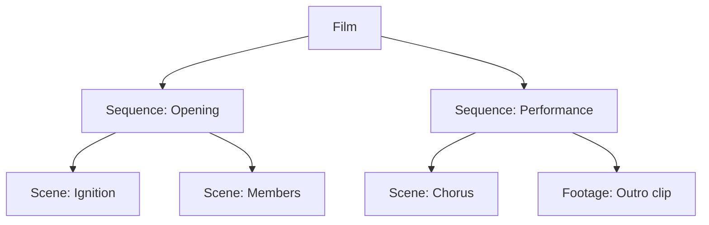

# Motion Studio MVP Plan: Sequences and Human Advice in the Existing Film Editor

**Repository:** `bettertogethersoftware/motion-studio`  
**Reviewed commit:** `8dc3ab05c457d1ba6eaa5629d3f49a7eb6c9b17e` (`master`)  
**Plan revision:** 4 — simplified first implementation  
**Main decision:** Extend the current Film editor and current Scene model. Do not build the larger V2 Film → Narrative Scene → Shot architecture yet.

---

## Implementation outcome (v0.23.1, 2026-08-02)

Shipped. The definition of done in §13 holds: `film.html` is the only film
surface, it opens in **Watch & Advise** with a Film → Sequence →
Scene/Footage tree and a Sequence row above Scenes, every timeline element is
an advice target through one popup, and the production controls sit behind an
**Advanced editing** toggle on the same page. `review.html` / `review.js` /
`review.css` are deleted and no longer served; `GET /api/films/:id/review`
became `/overview`. See [docs/CHANGELOG.md](../CHANGELOG.md) "One film page"
and [docs/architecture.md](../architecture.md) §14.1.

**Deliberate deviations, and why:**

- **The sequence data model stayed label-based** (§3 proposed `sequences[]`
  with opaque ids, a segment `id` on every entry, and a `FILM_SCHEMA_VERSION`
  1 → 2 migration). v0.23 already shipped `segment.sequence` + a
  `film.sequences` metadata map, and it satisfies every rule §3 asks for —
  `film.scenes[]` is the only play order, metadata holds no second copy of it,
  and bands are contiguous *by construction* because they derive from
  consecutive labels. Adding parallel ids would have meant a schema bump, a
  migration, and two things to keep in sync, in exchange for nothing the label
  model does not already do. Renaming rewrites the labels on member segments
  in one atomic patch.
- **Only footage segments were given an `id`.** §3 wanted one on every
  segment; scenes already have a stable, validated-unique handle — the slug —
  and the advice store already targets them by it. Footage genuinely needed
  one, because neither its path (the same plate may be cut in twice) nor its
  index (every reorder changes it) is an identity. `footage` therefore joined
  the advice target types (§5 listed it; v0.23 had degraded it to "the film at
  this time").
- **No first-open normalization pass, no "Main sequence".** §3 wanted every
  old film stamped on first read. Unlabeled segments simply render as an
  anonymous band that covers the timeline and navigates normally, so an old
  film needs no write at all to be fully usable — and Motion Studio never
  rewrites a document the human did not ask it to.
- **The pinned-delivery player was kept, not dropped.** §4 says "keep the
  current player"; the editor's scene-stitched preview is the default and is
  unchanged. But the delivery archive, its frozen manifests and the
  snapshot-consistent evidence model all shipped in v0.23, so the transport
  gained a `preview | built film` switch rather than losing them. One frame
  domain throughout; a build whose length no longer matches the cut says so.
- **Advice storage was not rebuilt.** §6 specifies a fresh
  `<film>/human-advice/<id>/` layout and four MCP tools. `<film>/advice/<id>/`
  and five tools (`check` / `acknowledge` / `begin_advice_work` / `resolve` /
  `list`) already existed with the same guarantees plus TTL leases and
  restart recovery, so the rework used them as-is. The three Studio HTTP
  routes in §6 already existed too.
- **Deferred, as §12 asks:** no shot entity, no per-track-item revision
  stores, no general rebuild planner, no destructive migration.

## 1. MVP outcome

Motion Studio remains AI-first:

- The AI is the director and production operator.
- The human watches and leaves asynchronous advice.
- There is no approval step and the AI never waits for the human.
- The current renderable **Scene** remains the smallest picture unit the AI rerenders.
- Agents continue following the existing rule: create one short Scene per shot or visual beat.
- A new **Sequence** groups related Scenes above the existing Scene timeline.
- Human advice is added from a popup on the existing Film page, not from a separate Review page.
- The MVP assumes one active AI director per Film. Multi-agent work claiming is deferred.

The first implementation must answer one practical problem:

> The human can click the exact Sequence, Scene, footage clip, audio item, caption, overlay, or film moment that looks wrong; leave advice; and the AI can later fix only the affected element and rebuild the film.

## 2. Why Sequence above Scene is the smaller change

The current engine already has most of the required behavior:

| Current implementation | Reuse in this MVP |
|---|---|
| `film.scenes[]` is the ordered film timeline | Keep it as the authoritative flat play order |
| A technical Scene is independently authored and rendered | Treat it as the shot-sized rerender unit |
| Footage can appear directly in `film.scenes[]` | Keep it as a non-Chromium timeline segment |
| Audio, captions, and overlays already have stable IDs | Use those IDs as advice targets |
| `render(scene)` renders one Scene | Reuse it for exact Scene rework |
| `build_film` reuses unchanged Scene outputs | Reuse it after targeted changes |
| The Film editor already has preview, tree rail, inspector, and timeline | Add Sequence/tree/advice behavior to this page |
| Studio already uses HTTP and job polling | Add small advice endpoints; do not add a new event architecture |

Do not rename the existing Scene APIs or storage folders in this MVP. Do not add a separate Shot repository. In product language, a Scene is expected to be shot-sized.

## 3. Minimal hierarchy and data change



Add only two concepts to the existing film document:

1. `sequences[]` contains Sequence ID and name.
2. Every existing `film.scenes[]` segment gets a stable `id` and `sequenceId`.

```json
{
  "name": "VANTA Burning Bright",
  "sequences": [
    { "id": "seq-opening", "name": "Opening" },
    { "id": "seq-performance", "name": "Performance" }
  ],
  "scenes": [
    { "id": "seg-ignition", "slug": "ignition", "sequenceId": "seq-opening" },
    { "id": "seg-members", "slug": "members", "sequenceId": "seq-opening" },
    { "id": "seg-chorus", "slug": "chorus", "sequenceId": "seq-performance" },
    {
      "id": "seg-outro",
      "footage": "assets/outro.mp4",
      "durationInFrames": 210,
      "sequenceId": "seq-performance"
    }
  ]
}
```

Rules:

- `film.scenes[]` remains the only source of play order. Film layout and assembly continue reading it exactly as today.
- `sequences[]` stores names/identity only; it does not contain a second copy of Scene order.
- `sequenceId` is grouping metadata on each Scene/footage segment.
- A Sequence must occupy one contiguous range in `film.scenes[]`.
- On first open, the server performs one atomic additive normalization before returning an old film to Studio: create **Main sequence**, stamp persistent segment IDs, and keep every existing field/order/output unchanged. IDs must not be regenerated on later reads.
- Bump `FILM_SCHEMA_VERSION` from 1 to 2 and implement one focused v1 → v2 film-document upgrade in the store; do not introduce a new data root or move Scene folders/assets.
- Audio, caption, and overlay structures remain unchanged.
- Moving a Scene within a Sequence changes only `film.scenes[]` order.
- Moving a Scene across Sequence boundaries changes its position and `sequenceId` in the same saved film update.

This requires small changes to `normalizeSegment`, `normalizeFilm`, `validateFilm`, the Studio `EDITABLE` list, and Film planning detail. The renderer, encoder, and assembler do not need a new domain model.

Extend the existing `update_film`/Film PATCH schema to accept `sequences`, and let `create_scene` accept an optional `sequenceId`. Do not add a separate Sequence service or a large set of Sequence MCP tools.

## 4. One-page Studio design

Do not create a Review route or Review page. Extend the current `film.html` screen shown in the supplied screenshot.

The existing automated render/delivery review files and warning policy may remain internal engine features. “No Review page” refers to human navigation, not removal of output validation.

| Existing area | MVP change |
|---|---|
| Left Scene rail | Replace with a collapsible `Film → Sequence → Scene/Footage` tree; keep **Unused scenes** at the bottom |
| Centre preview | Keep the current player and playhead behavior |
| Right inspector | Keep current details; show selected element's advice count and latest AI result in a compact section |
| Bottom timeline | Add one **Sequences** row directly above the existing **Scenes** row |
| Film toolbar | Add one prominent **Advise AI** action |

The default presentation is **Watch & Advise**. Existing production-edit controls are not deleted, but they move behind an **Advanced editing** toggle on the same page. This keeps the normal human interface simple while preserving current code and power-user behavior.

### Left tree behavior

- Film is the root.
- Each Sequence expands to its ordered Scene/footage children.
- Selecting a Sequence highlights its full timeline range and moves the playhead to its start.
- Selecting a Scene/footage child selects the existing timeline block and shows it in the preview.
- Timeline selection updates the matching tree item.
- In Advanced editing, the current **new scene** action adds to the selected Sequence, or Main sequence when none is selected.
- Advanced Sequence actions are limited to create, rename, and delete/reassign. Do not build a separate Sequence editor.

### Timeline behavior

- The new Sequence row displays one band spanning all contiguous member Scenes.
- Sequence bands align exactly with the existing Scene blocks beneath them.
- Clicking a Sequence band selects the Sequence.
- Existing Scene, audio, caption, and overlay editing code remains available in Advanced editing.
- In Advanced editing, Scene drag/reorder continues to edit the flat `film.scenes[]` array.
- Dropping across a Sequence boundary also changes the segment's `sequenceId`.

## 5. Human advice popup

Advice is contextual and stays on the Film page.

Human flow:

1. Watch or scrub the film.
2. Select an element in the left tree or timeline.
3. Click **Advise AI**. If nothing is selected, Studio temporarily asks the human to click a Sequence or timeline element.
4. A small modal/popover opens for that exact element.
5. Write one plain-language comment and click **Send advice**.
6. Continue watching or close Studio. Nothing waits for approval.

While this temporary advice-targeting mode is active, the next click on a tree node, Sequence band, Scene/footage block, audio clip, caption, or overlay opens the popup immediately. `Esc` cancels the mode, so ordinary timeline clicks are not hijacked.

The popup contains only:

- Target label, for example `Performance → Chorus` or `Caption at 00:14.2`
- Current film time/frame when relevant
- One comment box
- **Send advice** and **Cancel**
- When evidence exists, a small **Previous result** preview and **Ask AI to use this previous result** action

Target types:

- Film or exact film time
- Sequence
- Scene
- Footage segment
- Audio item
- Caption item
- Overlay item

Studio fills all IDs and timing automatically. The human never types an ID, chooses a provider, selects a job type, or decides what must be rerendered.

Advice markers are small comment-count badges on the tree/timeline element. Clicking a badge opens its short history in the same popup or right inspector. There is no separate advice/review page.

Human-facing states remain simple:

- **Advice sent**
- **AI received it**
- **Updated**
- **AI needs more information**

## 6. Minimal advice storage and communication

Store one atomic JSON record per advice item:

```text
<film>/human-advice/<advice-id>/
├── advice.json
├── before.json
├── before-preview.*
├── after.json
└── after-preview.*
```

`advice.json` contains:

- Advice ID, film ID, status, message, and timestamps
- Target type and stable target ID
- Sequence ID/Scene slug where applicable
- Film frame and item-relative frame when applicable
- Agent acknowledgement and resolution summary
- Before/after evidence filenames when available
- Optional reference to an earlier advice result the human prefers

Statuses are only `pending`, `acknowledged`, `resolved`, or `needs-clarification`.

Rules:

- Advice text is never cleared after the AI reads it.
- Advice submission succeeds after `advice.json` is durable; optional preview capture may finish afterward.
- Studio snapshots the selected element's JSON and current visible media/output when practical.
- For a Scene target, the before bundle also copies its small authored/config files and records referenced-asset identities so an old result can be reconstructed without duplicating every large asset.
- If preview copying fails, keep the advice and record an evidence warning.
- Existing advice is never edited. A follow-up is a new linked advice item.
- Studio may refresh/poll advice state using the existing HTTP style; a general SSE/event system is deferred.

### Studio HTTP additions

- [ ] `POST /api/films/:film/human-advice` — create advice from the selected element.
- [ ] `GET /api/films/:film/human-advice` — list advice and optional target/status filters.
- [ ] `GET /api/films/:film/human-advice/:id` — details and safe evidence URLs.

### MCP additions

- [ ] `check_human_advice` — return unresolved advice, oldest first; read-only.
- [ ] `acknowledge_human_advice` — record that the active AI received it.
- [ ] `resolve_human_advice` — record summary, changed targets, job IDs, and resulting output.
- [ ] `list_human_advice` — retrieve current or historical advice.

The MCP server cannot wake a stopped Codex/Claude session. Advice waits durably until the human continues an agent session or starts a new one.

## 7. AI workflow and minimum rework rules

Agent instructions must require `check_human_advice`:

1. At the start of work
2. After completing a Scene render
3. Before building the film
4. Before reporting completion

There is no blocking polling loop and no approval request.

| Advice target | AI action | Rendering rule |
|---|---|---|
| Sequence | Decide which member Scenes/items require change | Render only changed Scenes, then build film |
| Composition Scene | Edit that Scene and call existing `render(scene)` | Exactly that Scene is captured; other Scene outputs are reused |
| Footage segment | Replace/conform that segment reference | No Chromium Scene render; build film |
| Audio item/TTS/SFX/music | Replace or adjust that current audio item | No picture Scene render; rebuild audio/film |
| Caption | Update that caption item | No Scene render; build/finish only as required |
| Overlay/VFX item | Update that overlay item | No Scene render; finishing build only unless a source composition changed |
| Scene order or Sequence grouping | Update film metadata/order | No Scene render; rebuild film only if play order changed |

The existing build may still perform a full finishing encode for audio, burned captions, overlays, or platform versions. The MVP promise is:

> Unchanged Scenes are not rerendered, and unrelated generated media is not regenerated.

## 8. Basic previous-result support

Do not build a general immutable revision framework in this MVP.

Instead:

- Advice submission saves a **before** snapshot of the selected data and visible output when practical.
- A Scene before snapshot includes its authored/config files plus current rendered output; referenced large assets remain identity-pinned rather than blindly duplicated.
- `resolve_human_advice` records the **after** output/data and AI summary.
- The advice popup can preview those before/after results on the same Film page.
- **Ask AI to use this previous result** creates new advice referencing the exact saved result; it never changes production immediately.
- The AI may restore/copy the previous Scene source/output bundle, use it as a creative reference, or explain why it used another solution.
- Advice-linked evidence is retained; broad version browsing and automatic retention policies are deferred.

## 9. Implementation todo list

Repository rules from `CLAUDE.md` apply: work on `master`, commit/push only when explicitly requested, and update relevant documentation in the same change.

### Phase 1 — Sequence metadata with unchanged rendering

- [ ] Add `sequences[]`, segment `id`, and segment `sequenceId` normalization.
- [ ] Bump the film document to schema version 2 and add an atomic v1 → v2 additive upgrade in `_readFilmDoc`/a focused helper.
- [ ] Preserve those fields in `normalizeSegment` instead of stripping them.
- [ ] Add validation for unique Sequence/segment IDs, valid references, and contiguous membership.
- [ ] Atomically normalize existing films on first open into one Main sequence with persistent IDs, without changing Scene order or output files.
- [ ] Extend current Film PATCH/`update_film` and `create_scene` schemas with `sequences`/optional `sequenceId`; default safely to Main sequence.
- [ ] Return resolved Sequence ranges in `planFilm`/Studio film detail.
- [ ] Add focused `engine/test/films.test.js` and `engine/test/studio.test.js` coverage.
- [ ] Prove current Scene render and film build output are unchanged when only Sequence metadata is added.

**Exit:** Existing films build identically, while every Scene/footage segment belongs to a stable Sequence.

### Phase 2 — One-page tree and Sequence timeline row

- [ ] Replace the left Scene rail with the Film → Sequence → Scene/Footage tree.
- [ ] Preserve the current Unused scenes behavior beneath the tree.
- [ ] Add create/rename/delete-reassign Sequence actions.
- [ ] Add the Sequence row immediately above the current Scenes row.
- [ ] Synchronize tree, Sequence band, Scene block, preview, playhead, and inspector selection.
- [ ] Update Scene drag/reorder so cross-Sequence drops update `sequenceId` atomically.
- [ ] Add the **Advise AI** toolbar action and empty-selection targeting mode.
- [ ] Make Watch & Advise the default and place current production controls behind an Advanced editing toggle on the same page.
- [ ] Keep everything in `film.html`; add no Review page or route.

**Exit:** The human can reach any Sequence or existing timeline element on the one Film page without typing an ID.

### Phase 3 — Durable popup advice and MCP checks

- [ ] Add atomic per-advice JSON storage beneath each film.
- [ ] Add the three Studio HTTP routes and path-sandbox tests.
- [ ] Add the popup with automatic target/time capture and one comment box.
- [ ] Add advice badges/history to the existing tree, timeline, and inspector.
- [ ] Add `check`, `acknowledge`, `resolve`, and `list` MCP tools.
- [ ] Update `CLAUDE.md`, `docs/SKILL.md`, and `docs/SKILL-shell.md` with the four advice checkpoints and no-wait rule.
- [ ] Verify advice survives Studio/MCP restart and is not cleared on acknowledgement.

**Exit:** Advice left while the AI is absent is found and acted on during the next run from the same Film page.

### Phase 4 — Evidence, previous result, and end-to-end proof

- [ ] Capture before data, Scene authored/config files, and current frame/output using hard-link/copy fallback where safe.
- [ ] Record after data/output and concise AI summary on resolution.
- [ ] Add inline before/after preview in the same popup/inspector.
- [ ] Add **Ask AI to use this previous result** as new advice, not a direct restore.
- [ ] Prove Scene advice triggers one Scene render plus film build.
- [ ] Prove audio/caption/overlay advice triggers zero Scene renders.
- [ ] Prove Sequence advice may change several member Scenes but no unrelated Scene.
- [ ] Update `README.md`, `docs/architecture.md`, `docs/CHANGELOG.md`, `docs/user-guide.md`, `docs/film-setup.md`, and `docs/mcp-setup.md` with the shipped behavior.

**Exit:** The human can return later, see what was requested and changed, and ask the AI to reuse a prior result without introducing approval or a second page.

## 10. Acceptance scenarios

### A. Existing film gains Sequences

- [ ] Opening an existing film creates Main sequence metadata only.
- [ ] Scene order, Scene folders, outputs, audio, captions, overlays, and built film remain unchanged.

### B. Human advises one Scene

- [ ] Human selects `Performance → Chorus` and sends advice from the popup.
- [ ] Next AI run checks and acknowledges it.
- [ ] AI rerenders only Chorus and rebuilds the film from unchanged other Scene outputs.
- [ ] The popup later shows the AI summary and after result.

### C. Human advises sound or captions

- [ ] Human selects the exact timeline item and sends advice.
- [ ] AI changes that item and runs no Scene renderer.
- [ ] The resulting build and advice record update correctly.

### D. Human advises a Sequence

- [ ] Human selects a Sequence band or tree node.
- [ ] AI decides which member elements need work.
- [ ] No Scene outside the Sequence is rerendered unless the AI records a specific reason.

### E. AI is offline

- [ ] Advice remains **Advice sent** while no agent is running.
- [ ] Restarting Studio/MCP loses nothing.
- [ ] The next AI session discovers it at startup; Motion Studio does not pretend it can wake the agent.

### F. Previous result was better

- [ ] Human previews an advice-linked previous result in the popup.
- [ ] **Ask AI to use this previous result** creates new advice only.
- [ ] AI selects/reuses it or records a different decision; no human approval is requested.

### G. One-page requirement

- [ ] Tree navigation, film playback, Sequence/Scene tracks, advice popup, advice history, and result preview all remain on `film.html`.
- [ ] The page opens in Watch & Advise with production controls hidden behind Advanced editing.
- [ ] No Review page, task board, approval queue, or production-management screen is introduced.

## 11. Primary files to change

| Responsibility | Files |
|---|---|
| Film normalization/validation/ranges | `engine/src/core/films.js` |
| Storage paths and advice persistence | `engine/src/core/store.js` plus a small focused advice module if needed |
| Studio HTTP | `engine/src/studio/server.js` |
| One-page UI | `engine/src/studio/public/film.html`, `film.js`, and `film.css` |
| MCP tools | `engine/src/mcp/server.js` |
| Tests | `engine/test/films.test.js`, `studio.test.js`, `mcp.test.js`, and focused advice tests |
| Agent/documentation contract | `CLAUDE.md`, `docs/SKILL.md`, `docs/SKILL-shell.md`, film/MCP/user docs, architecture, changelog |

The core renderer, encoder, film concat/mix implementation, and job manager should change only when a test proves the additive design cannot reuse them.

## 12. Explicitly deferred after this MVP

- Separate Shot entity or Film → Narrative Scene → Shot storage redesign
- Generic revision repositories for every picture and sound item
- Immutable delivery-manifest architecture
- General dependency/rebuild planner
- General production event/SSE bus
- Multi-agent director/shot/advice leases
- Full optimistic-concurrency/ETag redesign
- Provider/model/seed dashboards
- Separate Review page
- Background AI director that can wake itself
- Destructive migration or deletion of current film data

## 13. Definition of done

> The existing Motion Studio Film editor gains a Sequence row above Scenes and a Film → Sequence → Scene/Footage tree on the left. From that same page, the human can select any existing timeline element, open a simple advice popup, and leave durable advice. The next AI run checks and acknowledges the advice, changes only the necessary Scene or timeline item, rerenders no unrelated Scene, rebuilds the film, and records the result. Previous results can be requested through new advice, never direct human promotion or approval. The implementation reuses the current Scene renderer, Film builder, timeline, HTTP server, and job system instead of introducing a large replacement architecture.
